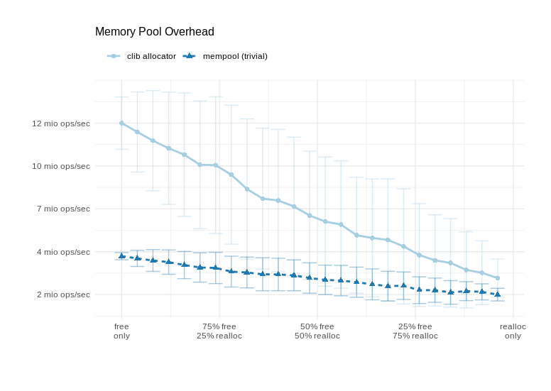

## Funndamentals
link for the basic [fundamentals](http://pinnecke.info/dl/lectures/pinnecke-ws1920_atdb_docsqljson.pdf).

### Programing Task
This [programing task](https://github.com/protolabs/libcarbon/blob/teaching/atdb/2019/atdb_2019_programming_sheet_pinnecke.pdf) is to become involved and make my hands dirty in the research related to memorypool.

#### Task1
##### 1.1
My Registration number Goes Hear
##### 1.2
My system information 
```
System:    Host: aravind-Lenovo-Z50-70 Kernel: 4.15.0-52-generic x86_64 (64 bit) Desktop: Unity 7.4.5
           Distro: Ubuntu 16.04 xenial
Machine:   System: LENOVO (portable) product: 20354 v: Lenovo Z50-70
           Mobo: LENOVO model: Lancer 5A5 v: NANANANANO DPK Bios: LENOVO v: 9BCN25WW date: 04/10/2014
CPU:       Dual core Intel Core i5-4210U (-HT-MCP-) cache: 3072 KB 
           clock speeds: max: 2700 MHz 1: 1712 MHz 2: 1589 MHz 3: 1396 MHz 4: 1630 MHz
Graphics:  Card-1: Intel Haswell-ULT Integrated Graphics Controller
           Card-2: NVIDIA GM108M [GeForce 840M]
           Display Server: X.Org 1.19.6 drivers: (unloaded: fbdev,vesa) FAILED: nouveau
           Resolution: 1920x1080@60.00hz
           GLX Renderer: Mesa DRI Intel Haswell Mobile GLX Version: 3.0 Mesa 18.0.5
Audio:     Card-1 Intel 8 Series HD Audio Controller driver: snd_hda_intel Sound: ALSA v: k4.15.0-52-generic
           Card-2 Intel Haswell-ULT HD Audio Controller driver: snd_hda_intel
Network:   Card-1: Realtek RTL8111/8168/8411 PCI Express Gigabit Ethernet Controller driver: r8169
           IF: enp1s0 state: down mac: 28:d2:44:89:a9:f0
           Card-2: Qualcomm Atheros QCA9565 / AR9565 Wireless Network Adapter driver: ath9k
           IF: wlp2s0 state: up mac: b8:ee:65:7d:f8:43
Drives:    HDD Total Size: 500.1GB (10.1% used) ID-1: /dev/sda model: Samsung_SSD_860 size: 500.1GB
Partition: ID-1: / size: 144G used: 46G (34%) fs: ext4 dev: /dev/sda5
           ID-2: swap-1 size: 1.02GB used: 0.07GB (7%) fs: swap dev: /dev/sda6
RAID:      No RAID devices: /proc/mdstat, md_mod kernel module present
Sensors:   System Temperatures: cpu: 53.0C mobo: N/A
           Fan Speeds (in rpm): cpu: N/A
Info:      Processes: 284 Uptime: 6:33 Memory: 2316.2/7873.1MB Client: Shell (bash) inxi: 2.2.35 

```
Memory pool overhead graph
<p align="center">
  
</p>

#### Task 2 Improving the Memory Pool
All the strategy will be explained hear  

#### Task 3 Discussion

### Research Ideas for thesis (JSON to CARBON conversion)
